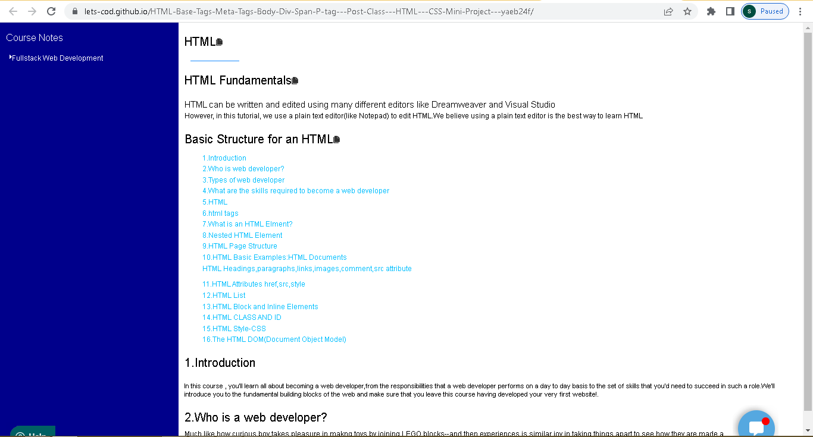

Hosted URL: https://lets-cod.github.io/HTML-Base-Tags-Meta-Tags-Body-Div-Span-P-tag---Post-Class---HTML---CSS-Mini-Project---yaeb24f/

1.Write the project description
In this project i have made a UI design for web page which describes the portfolio of client.

2.WHY this project was chosen
I have choosen this project because there is lot to learn from this project related to html and css property

3.HOW did you make the project.
I have used HTML and CSS for UI design. With the help of different tags i have created
different section using grid-template-columns,flex-box and used different property to arrange the content in UI design.
I have used @media screen to arrange the content of page on window resize.

4.WHAT features, technical things you had implemented.
I have used flexbox to assign div elements using flexbox property
such as justify-content:space-between,flex-direction:column etc.
